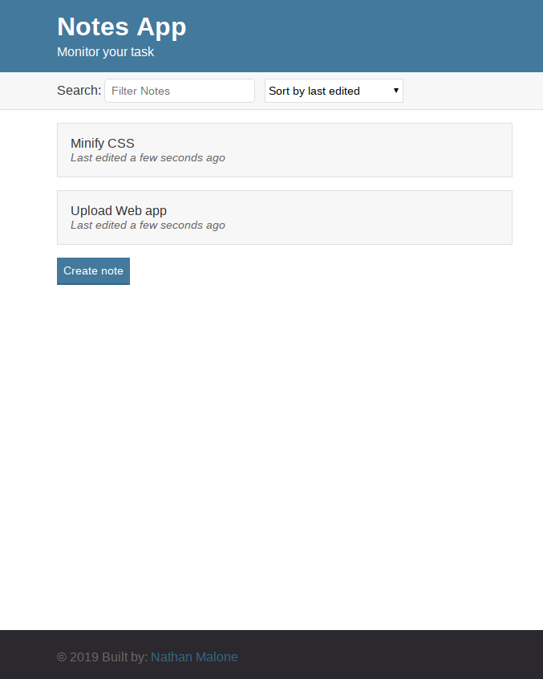
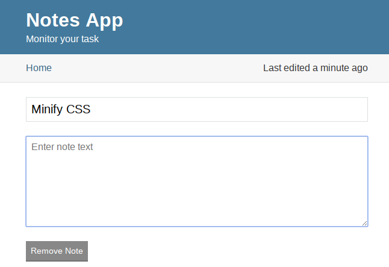

# Notes App
JavaScript ES6 Notes app to track your task

#### Description ####
Note app to track your task.
**Create**, **modify** or **delete** notes. Notes an be sorted alphabetically, last edited or latest published.

Each note displays a title, created or edited timestamp.

Notes are saved to local storage in the browser.

#### Modify Notes ####
Clicking on a note will open the edit screen where notes can be modified or removed.

#### Installation ####
1. Clone the repo or download the zip file.
2. From the CL run **npm install** to install dependencies.
3. Run the file in a local server.
4. Enjoy!

##### Author #####
Nathan Malone

##### Usage #####
This software is for educational purposes only. It should not be used in production or distributed commercially.